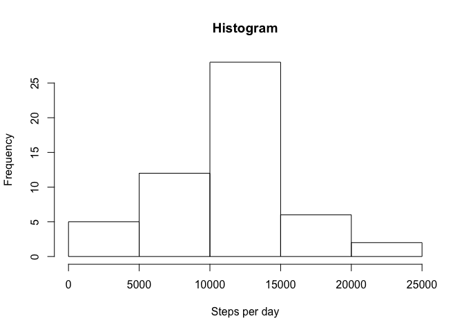

# Reproducible Research: Peer Assessment 1


### Loading and peaking into the data


```r
unzip(zipfile = "activity.zip")
data <- read.csv("activity.csv")
```

### Processing: removing NA from data


```r
good <- complete.cases(data)
data <- data[good,] 

head(data)
```

```
##     steps       date interval
## 289     0 2012-10-02        0
## 290     0 2012-10-02        5
## 291     0 2012-10-02       10
## 292     0 2012-10-02       15
## 293     0 2012-10-02       20
## 294     0 2012-10-02       25
```


### Calculate the total number of steps taken per day


```r
steps_per_day <- aggregate(data$steps, by=list(day = data$date), "sum")
head(steps_per_day)
```

```
##          day     x
## 1 2012-10-02   126
## 2 2012-10-03 11352
## 3 2012-10-04 12116
## 4 2012-10-05 13294
## 5 2012-10-06 15420
## 6 2012-10-07 11015
```


### Make a histogram of the total number of steps taken each day


```r
hist(steps_per_day$x, main="Histogram", xlab="Steps per day")
```

<!-- -->

### Calculate and report the mean and median of the total number of steps taken per day


```r
mean(steps_per_day$x)
```

```
## [1] 10766.19
```

```r
median(steps_per_day$x)
```

```
## [1] 10765
```


## What is the average daily activity pattern?

 
Make a time series plot (i.e. 𝚝𝚢𝚙𝚎 = "𝚕") of the 5-minute interval (x-axis) and the average number of steps taken, averaged across all days (y-axis)


```r
require(graphics)

activity <- aggregate( formula = steps~interval, 
           data = data,
           FUN = mean)


head(activity)
```

```
##   interval     steps
## 1        0 1.7169811
## 2        5 0.3396226
## 3       10 0.1320755
## 4       15 0.1509434
## 5       20 0.0754717
## 6       25 2.0943396
```

```r
plot(activity , type="l") 
```

<!-- -->

```r
active_interval <- activity[which.max(activity$steps),]

active_interval
```

```
##     interval    steps
## 104      835 206.1698
```

```r
hr <- active_interval / 60

hr
```

```
##     interval    steps
## 104 13.91667 3.436164
```

### Which 5-minute interval, on average across all the days in the dataset, contains the maximum number of steps?


## Imputing missing values


## Are there differences in activity patterns between weekdays and weekends?
